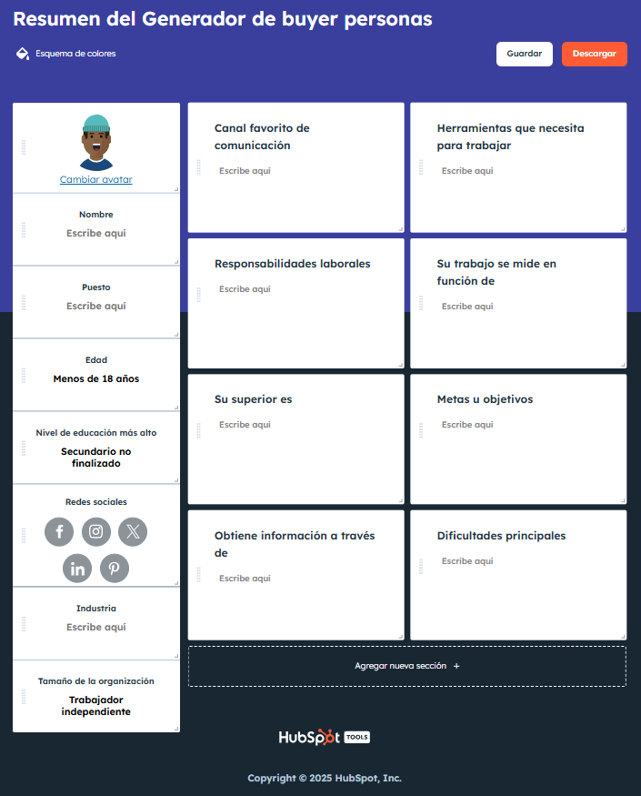

# Ejercicios de Buyer Personas

**Tiempo estimado**: 60 minutos

**Modalidad**: Actividad en grupos pequeños

Esta actividad te permite aplicar metodologías empresariales reales para crear perfiles detallados de audiencia, utilizando la herramienta profesional de HubSpot y analizando cómo estos perfiles se adaptan entre diferentes mercados culturales.

## Objetivos de la actividad

Al completar este ejercicio, podrás:
- **Utilizar** herramientas profesionales de marketing para crear buyer personas
- **Analizar** diferencias culturales en perfiles de audiencia
- **Evaluar** cómo los buyer personas influyen en decisiones de traducción
- **Integrar** voz de marca con análisis de audiencia para estrategias coherentes

## Herramienta Principal: HubSpot Generador de Buyer Personas

### Acceso a la Herramienta
🔗 **Link directo**: [HubSpot Generador de buyer personas](https://www.hubspot.es/make-my-persona)

### Recordatorio Importante
**Las organizaciones suelen tener múltiples buyer personas** para diferentes segmentos de su audiencia. En esta actividad, te enfocarás en crear **un buyer persona primario** para tu empresa seleccionada, pero ten en cuenta que las empresas reales desarrollan varios perfiles para cubrir toda su base de clientes.

## Instrucciones del Ejercicio

### Paso 1: Preparación

**Trabajen con la misma empresa** que analizaron en la actividad anterior de voz de marca:
- Netflix
- Bimbo  
- Mercado Libre/Amazon
- Walmart/Bodega Aurrerá
- McDonald's

Identifiquen cuál será su **mercado fuente** para crear el buyer persona inicial:

**Opciones de mercados fuente:**
- **EN-US → ES-MX**: Para empresas estadounidenses expandiéndose a México (Netflix, Walmart, McDonald's, Amazon)
- **ES-MX → EN-US**: Para empresas mexicanas expandiéndose a Estados Unidos (Bimbo)
- **ES-MX → ES-Argentina/España**: Para empresas con expansión entre mercados hispanohablantes (Mercado Libre)

### Paso 2: Creación del Buyer Persona Fuente (25 minutos)

Utilicen el **Generador de HubSpot** para crear su buyer persona paso a paso:

#### Página por Página en HubSpot:
1. **Información básica**: Nombre, edad, ubicación
2. **Información demográfica**: Educación, familia, ingresos
3. **Información profesional**: Puesto, industria, tamaño de empresa
4. **Metas y objetivos**: Aspiraciones personales y profesionales
5. **Desafíos y puntos de dolor**: Obstáculos principales
6. **Fuentes de información**: Dónde obtiene información
7. **Comportamiento de compra**: Cómo toma decisiones
8. **Preferencias de comunicación**: Canales favoritos

Una vez completado, **descarguen el "Resumen del Generador de buyer personas"** que se ve así:

*Figura: Ejemplo del resumen generado por la herramienta de HubSpot*

### Paso 3: Análisis de Adaptación Transcultural (15 minutos)

Ahora analicen **cómo cambiaría este buyer persona** al dirigirse al mercado objetivo:

#### Tabla de Análisis Comparativo

| **Elemento del Buyer Persona** | **Mercado Fuente** | **Mercado Objetivo** | **Razón del Cambio** |
|---|---|---|---|
| **Datos demográficos** | [Edad, educación, ingresos] | [¿Cambian estos factores?] | [Diferencias socioeconómicas] |
| **Contexto cultural** | [Valores, tradiciones] | [Adaptaciones necesarias] | [Diferencias culturales] |
| **Metas y aspiraciones** | [Objetivos originales] | [¿Prioridades diferentes?] | [Contexto sociocultural] |
| **Desafíos principales** | [Problemas del mercado fuente] | [¿Obstáculos locales?] | [Contexto económico/social] |
| **Fuentes de información** | [Medios preferidos] | [¿Canales locales diferentes?] | [Preferencias mediáticas] |
| **Comportamiento de compra** | [Proceso de decisión] | [¿Patrones culturales?] | [Normas de consumo local] |
| **Preferencias de comunicación** | [Tono, formalidad, canales] | [Adaptaciones lingüísticas] | [Normas comunicativas] |

#### Ejemplo de Análisis: Coca-Cola

| **Elemento** | **EN-US** | **ES-MX** | **Razón del Cambio** |
|---|---|---|---|
| **Contexto cultural** | Individualismo, autorrealización | Familia, tradiciones compartidas | Cultura colectivista mexicana |
| **Metas de consumo** | Energía personal, estilo de vida | Momentos familiares, celebraciones | Diferente significado social del producto |
| **Fuentes de información** | Influencers, redes sociales | TV tradicional, eventos familiares | Diferentes patrones mediáticos |
| **Comportamiento de compra** | Individual, conveniencia | Familiar, ocasiones especiales | Diferentes contextos de consumo |

## Integración con Voz de Marca

Conecten su buyer persona con el análisis de voz de marca de la actividad anterior:

### Preguntas de Integración:
1. **Coherencia**: ¿Cómo se alinea la voz de marca de su empresa con las características de su buyer persona?
2. **Adaptación necesaria**: ¿Qué elementos de la voz de marca deben adaptarse para resonar con el buyer persona del mercado objetivo?
3. **Oportunidades**: ¿Qué aspectos del buyer persona sugieren oportunidades para mejorar la comunicación de marca?

## Publicación Grupal

Cada grupo publicará su investigación integrada en el canal **"Voz de Marca y Buyer Personas"** de nuestro Teams con la siguiente información:

### Contenido del Post

**Línea de asunto**: "Buyer Personas de [Nombre de Empresa] - [Nombres del equipo]"

1. **Empresa y mercados** con que trabajaron
2. **Cambios culturales clave** observados y su impacto
3. **1 recomendación** para mejorar la comunicación con el buyer persona meta
4. **Implicaciones clave** para traductores especializados

**📎 Adjuntar**: Resumen del buyer persona descargado de HubSpot

## Reflexión Post-Ejercicio

Considera estas preguntas mientras revisas las publicaciones de otros grupos:

- ¿Qué patrones observas en las diferencias de buyer personas entre mercados?
- ¿Cómo influyen estos cambios en las decisiones de traducción especializada?
- ¿Qué elementos culturales son más universales vs. más específicos por mercado?
- ¿Cómo puedes aplicar estas metodologías en tu trabajo futuro como traductor?

## Conexión con la Tarea

Este ejercicio te prepara directamente para tu [Tarea: Perfil Corporativo](tarea-perfil-corporativo.md), donde desarrollarás un análisis más profundo de la empresa seleccionada, integrando tu análisis de voz de marca y buyer personas en un reporte profesional.

---

## 📥 Descarga este Contenido
Encuentra este archivo [en nuestro repositorio](https://github.com/alainamb/uic_tr14-trad-comercial/blob/main/unidad1/semana2/ejercicios-buyer-personas.md) y descárgalo.

### 🤖 Prompts de Estudio con IAG
Copia el contenido descargado y prueba estos prompts:
- "Analiza las diferencias culturales en buyer personas entre [mercado fuente] y [mercado objetivo] para [empresa específica]"
- "¿Cómo debería adaptar la estrategia de comunicación de [empresa] basándome en las diferencias de buyer personas identificadas?"
- "Crea recomendaciones específicas para traducir contenido de [empresa] considerando tanto su voz de marca como su buyer persona objetivo"
- "¿Qué elementos del buyer persona mexicano son más importantes para decisiones de localización en [sector específico]?"
- "Compara las metodologías de HubSpot con otras herramientas de creación de buyer personas para traducción comercial"

---

**Próxima actividad**: [Tarea: Perfil Corporativo](tarea-perfil-corporativo.md) donde aplicarás estos conceptos a una empresa nueva en un proyecto individual evaluado.
